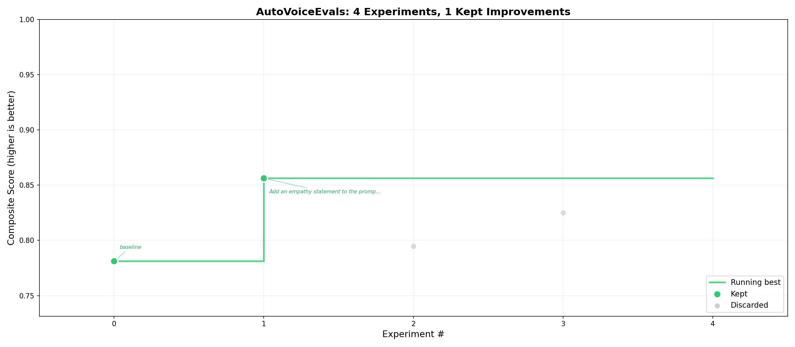

# Auto-researcher

## Score Progression

<p align="center">
  
</p>


AutoVoiceEvals is an iterative prompt optimization tool for voice agents.

It runs a simple loop:

1. Propose one prompt change
2. Evaluate against adversarial scenarios
3. Keep if score improves, otherwise revert
4. Repeat

Supported providers:
- Vapi
- Smallest AI
- ElevenLabs ConvAI

The LLM layer uses Groq for scenario generation, evaluation, and prompt improvement.

## What You Get

- Fixed eval suite per run for fair comparisons
- Baseline + per-experiment scoring
- Keep/discard decisioning with rollback
- Best prompt export
- Full JSON + TSV logs

## Requirements

- Python 3.10+
- Groq API key
- One provider API key (Vapi, Smallest, or ElevenLabs)

## Installation

```bash
git clone https://github.com/ArchishmanSengupta/autovoiceevals.git
cd autovoiceevals
pip install -r requirements.txt
```

## Environment Variables

Create a `.env` file in the project root.

```env
# Required for LLM tasks
GROQ_API_KEY=gsk_...

# Provider key (set the one you use)
VAPI_API_KEY=...
SMALLEST_API_KEY=...
ELEVENLABS_API_KEY=...
```

## Configuration

Copy one of the examples and edit it:

```bash
cp examples/vapi.config.yaml config.yaml
# or
cp examples/smallest.config.yaml config.yaml
# or
cp examples/elevenlabs.config.yaml config.yaml
```

Minimum required fields in `config.yaml`:

```yaml
provider: elevenlabs  # or vapi, smallest

assistant:
  id: "your-agent-id"
  description: |
    What your assistant does, policies, boundaries, and context.
```

Important notes:
- `assistant.description` heavily influences attack quality.
- `autoresearch.max_experiments: 0` means unlimited experiments.
- `assistant.dynamic_variables` is useful for provider tool/runtime placeholders (especially ElevenLabs).

## Usage

### Autoresearch Mode (recommended)

```bash
python main.py research
```

Resume an existing run:

```bash
python main.py research --resume
```

Use a custom config file:

```bash
python main.py research --config config.yaml
```

### Pipeline Mode (single pass)

```bash
python main.py pipeline
```

### Results View

```bash
python main.py results
```

## How Scoring Works

Composite score:

```text
composite = should_weight * should_score
          + should_not_weight * should_not_score
          + latency_weight * latency_score
```

You can tune these under `scoring` in `config.yaml`.

## Output Files

Run outputs are stored in `results/`:

- `results.tsv`: experiment-by-experiment summary
- `autoresearch.json`: full run details
- `best_prompt.txt`: best prompt found
- `*.png`: charts (when enabled)

## Commands Summary

```bash
python main.py research
python main.py research --resume
python main.py pipeline
python main.py results
```

## Project Structure

```text
autovoiceevals/
  main.py
  config.yaml
  requirements.txt
  examples/
    vapi.config.yaml
    smallest.config.yaml
    elevenlabs.config.yaml
  autovoiceevals/
    cli.py
    config.py
    evaluator.py
    researcher.py
    pipeline.py
    results.py
    llm.py
    vapi.py
    smallest.py
    elevenlabs.py
    models.py
    scoring.py
    display.py
    graphs.py
```

## License

MIT. See `LICENSE`.
